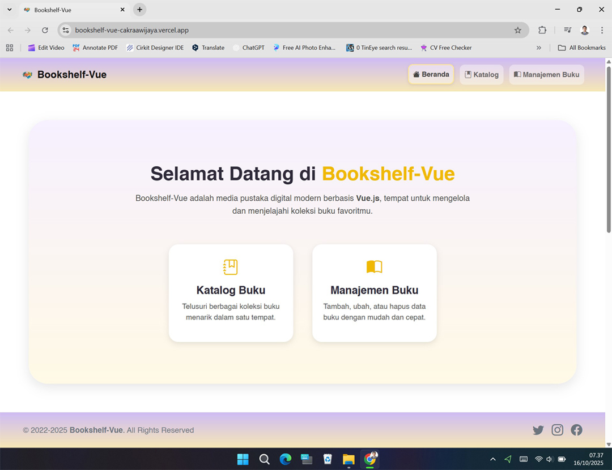
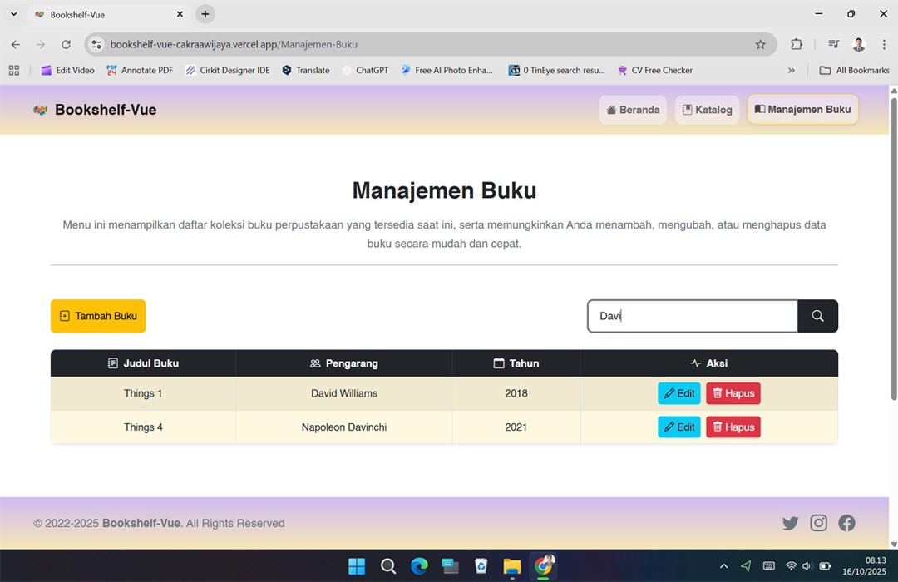

[](https://github.com/ellerbrock/open-source-badges/)
[](https://opensource.org/licenses/MIT)


# Bookshelf-Vue
<p>Bookshelf-Vue adalah aplikasi perpustakaan digital berbasis Vue.js yang memiliki fitur manajemen buku dan tampilan katalog.</p>

<br>

## Kebutuhan Proyek
| Bagian | Deskripsi |
| --- | --- |
| Fitur | • Buat<br>• Baca<br>• Ubah<br>• Hapus |
| Kerangka kerja | • Bootstrap 5<br>• Vue.js |
| Peralatan | • Visual Studio Code<br>• Node.js |

<br>

## Unduh & Instal
1. Visual Studio Code

   <table><tr><td width="810">
      
   ```
   https://bit.ly/VScode_Installer
   ```
   
   </td></tr></table><br>
   
2. NodeJS

   <table><tr><td width="810">
      
   ```
   https://bit.ly/NodeJS_Installer
   ```
   
   </td></tr></table><br>
   
3. Visual Studio Code Extensions : 

   <table><tr><td width="810">
      
   ``` Prettier & Vetur ```
   
   </td></tr></table>
   
<br><br>

## Memulai
1. Unduh dan ekstrak repositori ini.<br><br>

2. Buka direktori ``` bookshelf-vue ```, lalu buka ``` CMD ``` di dalam direktori tersebut.<br><br>

   • Pertama, Jika anda ``` belum menginstal vue/cli ```, jalankan perintah:

   <table><tr><td width="810">
      
   ````bash
   npm install -g @vue/cli
   ````
   
   </td></tr></table><br>

   • Kedua, langkah ini wajib dilakukan, jadi silakan salin perintah berikut:

   <table><tr><td width="810">

   ````bash
   npm run serve
   ````
   
   </td></tr></table><br>

3. Buka ``` peramban ``` anda (Tab baru), lalu ketik -> ``` http://localhost:8080/ ``` atau sesuaikan yang ada di ``` CMD ``` anda.<br><br>

4. Silakan akses fitur-fiturnya dan nikmatilah [Selesai].

<br><br>

## Sorotan
<table>
<tr>
<th width="280">Beranda</th>
<th width="280">Katalog</th>
<th width="280">Pencarian</th>
</tr>
<tr>
<td></td>
<td></td>
<td></td>
</tr>
</table>
<table>
<tr>
<th width="280">Tambah Buku</th>
<th width="280">Ubah Buku</th>
<th width="280">Hapus Buku</th>
</tr>
<tr>
<td></td>
<td></td>
<td></td>
</tr>
</table>

<br><br>

## Apresiasi
Jika karya ini bermanfaat bagi anda, maka dukunglah karya ini sebagai bentuk apresiasi kepada penulis dengan mengklik tombol ``` ⭐Bintang ``` di bagian atas repositori.

<br><br>

## Penafian
Aplikasi ini merupakan hasil pengembangan dari Kursus CAMP404. Saya tidak memungkiri bahwa saya masih menggunakan layanan pihak ketiga dalam pengerjaan ini, antara lain: library, framework, dan lain sebagainya.

<br><br>

## LISENSI 
LISENSI MIT - Hak Cipta © 2022 - Devan C. M. Wijaya, S.Kom

Dengan ini diberikan izin tanpa biaya kepada siapa pun yang mendapatkan salinan perangkat lunak ini dan file dokumentasi terkait perangkat lunak untuk menggunakannya tanpa batasan, termasuk namun tidak terbatas pada hak untuk menggunakan, menyalin, memodifikasi, menggabungkan, mempublikasikan, mendistribusikan, mensublisensikan, dan/atau menjual salinan Perangkat Lunak ini, dan mengizinkan orang yang menerima Perangkat Lunak ini untuk dilengkapi dengan persyaratan berikut:

Pemberitahuan hak cipta di atas dan pemberitahuan izin ini harus menyertai semua salinan atau bagian penting dari Perangkat Lunak.

DALAM HAL APAPUN, PENULIS ATAU PEMEGANG HAK CIPTA DI SINI TETAP MEMILIKI HAK KEPEMILIKAN PENUH. PERANGKAT LUNAK INI DISEDIAKAN SEBAGAIMANA ADANYA, TANPA JAMINAN APAPUN, BAIK TERSURAT MAUPUN TERSIRAT, OLEH KARENA ITU JIKA TERJADI KERUSAKAN, KEHILANGAN, ATAU LAINNYA YANG TIMBUL DARI PENGGUNAAN ATAU URUSAN LAIN DALAM PERANGKAT LUNAK INI, PENULIS ATAU PEMEGANG HAK CIPTA TIDAK BERTANGGUNG JAWAB, KARENA PENGGUNAAN PERANGKAT LUNAK INI TIDAK DIPAKSAKAN SAMA SEKALI, SEHINGGA RISIKO ADALAH MILIK ANDA SENDIRI.
