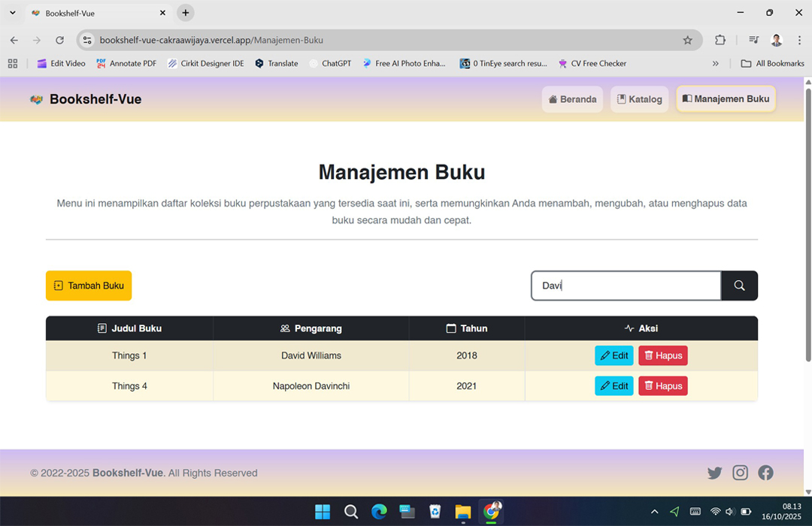

[](https://github.com/ellerbrock/open-source-badges/)
[](https://opensource.org/licenses/MIT)


# Bookshelf-Vue
<p>Bookshelf-Vue is a Vue.js-based digital library application that features book management and catalog display.</p>

<br>

## Project Requirements
| Part | Description |
| --- | --- |
| Features | • Create<br>• Read<br>• Update<br>• Delete |
| Framework | • Bootstrap 5<br>• Vue.js |
| Tools | • Visual Studio Code<br>• Node.js |

<br>

## Download & Install
1. Visual Studio Code

   <table><tr><td width="810">
   
   ```
   https://bit.ly/VScode_Installer
   ```
   
   </td></tr></table><br>
   
2. NodeJS

   <table><tr><td width="810">
   
   ```
   https://bit.ly/NodeJS_Installer
   ```
   
   </td></tr></table><br>
   
3. Visual Studio Code Extensions

   <table><tr><td width="810">

   ``` Prettier & Vetur ```
   
   </td></tr></table>

<br><br>

## Get Started
1. Download and extract this repository.<br><br>
   
2. Open the ``` bookshelf-vue ``` directory, then open ``` CMD ``` inside the directory.<br><br>

   • First, If you have ``` not installed vue/cli ```, run the command:

   <table><tr><td width="810">

   ````bash
   npm install -g @vue/cli
   ````
   
   </td></tr></table><br>
   
   • Secondly, this step is mandatory, so please copy the following command:

   <table><tr><td width="810">

   ````bash
   npm run serve
   ````
   
   </td></tr></table><br>

3. Open your ``` browser ``` (New tab), then type -> ``` http://localhost:8080/ ``` or customize the one on your ``` CMD ```.<br><br>

4. Please access the features and enjoy [Done].

<br><br>

## Deploy on Vercel
1. Open the Vercel platform:&nbsp;&nbsp;<strong><a href="https://vercel.com/new?utm_medium=default-template&filter=next.js&utm_source=create-next-app&utm_campaign=create-next-app-readme">Click Here</a></strong> &nbsp;, then register and log in first.<br><br>
2. Allow Vercel to access the repository.<br><br>
3. Upload the project to GitHub.<br><br>
4. Log in to the Vercel dashboard:&nbsp;&nbsp;<strong><a href="https://vercel.com/dashboard">Click Here</a></strong><br><br>
5. Click ``` Add New Project ```.<br><br>
6. Select the desired GitHub repository.<br><br>
7. Click ``` Deploy ```.

<br><br>

## Highlights
<table>
<tr>
<th width="280">Home</th>
<th width="280">Catalog</th>
<th width="280">Search</th>
</tr>
<tr>
<td></td>
<td></td>
<td></td>
</tr>
</table>
<table>
<tr>
<th width="280">Add Book</th>
<th width="280">Edit Book</th>
<th width="280">Delete Book</th>
</tr>
<tr>
<td></td>
<td></td>
<td></td>
</tr>
</table>

<br><br>

## Appreciation
If this work is useful to you, then support this work as a form of appreciation to the author by clicking the ``` ⭐Star ``` button at the top of the repository.

<br><br>

## Disclaimer
This application is the result of the development of the CAMP404 Course. I do not deny that I still use third-party services in this work, including: libraries, frameworks, and so on.

<br><br>

## LICENSE
MIT License - Copyright © 2022 - Devan C. M. Wijaya, S.Kom

Permission is hereby granted without charge to any person obtaining a copy of this software and the software-related documentation files to deal in them without restriction, including without limitation the right to use, copy, modify, merge, publish, distribute, sublicense, and/or sell copies of the Software, and to permit persons receiving the Software to be furnished therewith on the following terms:

The above copyright notice and this permission notice must accompany all copies or substantial portions of the Software.

IN ANY EVENT, THE AUTHOR OR COPYRIGHT HOLDER HEREIN RETAINS FULL OWNERSHIP RIGHTS. THE SOFTWARE IS PROVIDED AS IS, WITHOUT WARRANTY OF ANY KIND, EITHER EXPRESS OR IMPLIED, THEREFORE IF ANY DAMAGE, LOSS, OR OTHERWISE ARISES FROM THE USE OR OTHER DEALINGS IN THE SOFTWARE, THE AUTHOR OR COPYRIGHT HOLDER SHALL NOT BE LIABLE, AS THE USE OF THE SOFTWARE IS NOT COMPELLED AT ALL, SO THE RISK IS YOUR OWN.
